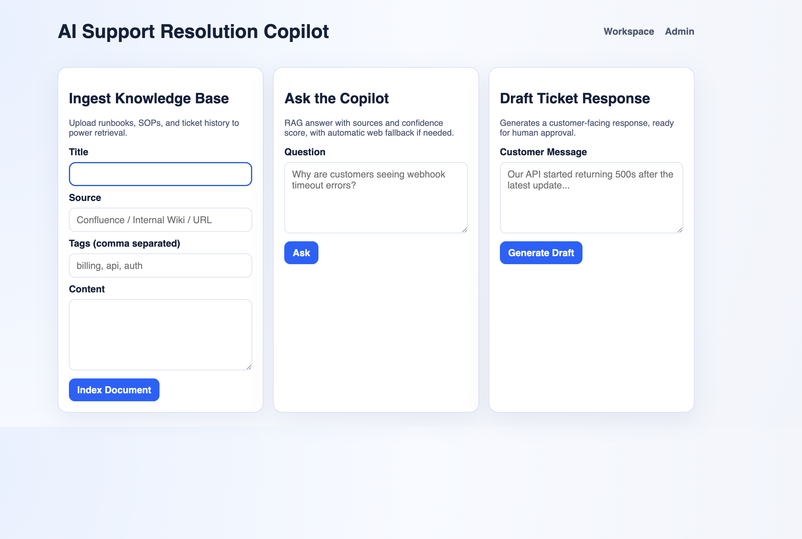
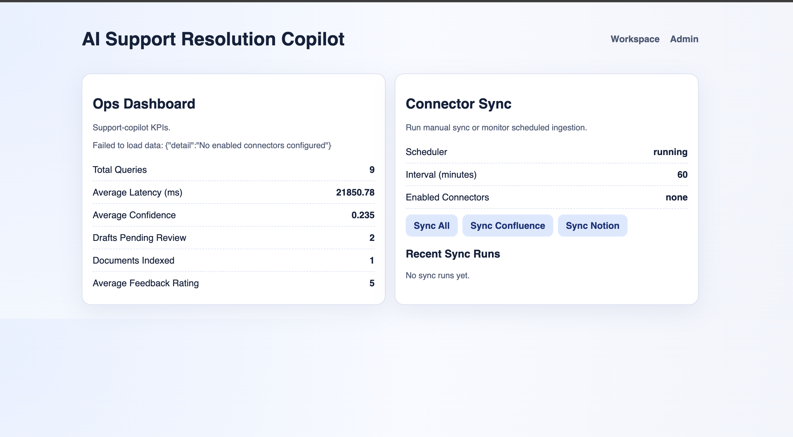

# AI Support Resolution Copilot

Full-stack, resume-ready project that combines:
- LLM-powered support workflows
- Hybrid RAG (vector + lexical retrieval)
- Evaluation pipelines for retrieval and answer quality
- Human-in-the-loop ticket drafting
- Frontend + backend + database + deployment

## Screenshots

### Workspace UI



### Admin + Connector Sync UI



## Architecture

- `apps/frontend`: Next.js dashboard for ingestion, Q&A, ticket drafting, and metrics.
- `apps/backend`: FastAPI API for ingestion, retrieval, chat, ticket draft generation, feedback, and metrics.
- `Postgres + pgvector`: stores documents/chunks and vector embeddings.

## Core Features

1. Document ingestion (`/api/ingest/documents`) with automatic chunking and embedding.
2. Hybrid retrieval (`semantic + full-text`) with reciprocal rank fusion.
3. Copilot chat (`/api/chat`) that returns answer + citations + confidence + latency, with automatic web fallback when internal confidence is low.
4. Ticket draft generation (`/api/tickets/draft`) for support responses.
5. Connector sync for Confluence + Notion with scheduled incremental ingestion.
6. Ops metrics (`/api/metrics`) and feedback capture (`/api/feedback`).
7. Evaluation Lab (`/api/evals/*`) for benchmark cases, retrieval hit rate, precision@k, recall@k, answer coverage, grounding score, and heuristic hallucination risk.

## Local Run (Docker)

### 1) Configure env

```bash
cd ai-support-copilot
cp .env.example .env
# Add OPENAI_API_KEY in .env for real model responses.
# Without it, the app uses deterministic local fallbacks.
```

### 2) Start stack

```bash
docker compose up --build
```

Services:
- Frontend: `http://localhost:3000`
- Backend API: `http://localhost:8000`
- Health check: `http://localhost:8000/health`

### 3) Use the app

1. Ingest a support document from the home page.
2. Ask a support question to validate citation-grounded retrieval.
3. Generate a ticket draft from a customer message.
4. Open `/admin` to see KPIs.

## Connector Sync Setup

Enable one or both connectors in `.env`:

```env
# Scheduler
SYNC_SCHEDULER_ENABLED=true
SYNC_INTERVAL_MINUTES=60

# Confluence
CONFLUENCE_ENABLED=true
CONFLUENCE_BASE_URL=https://your-domain.atlassian.net
CONFLUENCE_EMAIL=you@company.com
CONFLUENCE_API_TOKEN=your_confluence_api_token
CONFLUENCE_SPACE_KEYS=SUPPORT,ENG

# Notion
NOTION_ENABLED=true
NOTION_API_TOKEN=secret_xxx
NOTION_DATABASE_IDS=database_id_1,database_id_2
```

Manual sync endpoints:

```bash
curl -X POST http://localhost:8000/api/sync/run \
  -H "Content-Type: application/json" \
  -d '{"connector":"all"}'
```

```bash
curl http://localhost:8000/api/sync/runs?limit=20
```

```bash
curl http://localhost:8000/api/sync/status
```

## API Quick Test

```bash
curl -X POST http://localhost:8000/api/ingest/documents \
  -H "Content-Type: application/json" \
  -d '{
    "documents": [{
      "title": "Webhook Timeout Runbook",
      "source": "Internal Wiki",
      "content": "If webhook delivery fails with timeout, verify DNS, check outbound firewall rules, and increase retry backoff to 30s.",
      "tags": ["webhooks", "timeouts"]
    }]
  }'
```

```bash
curl -X POST http://localhost:8000/api/chat \
  -H "Content-Type: application/json" \
  -d '{"question":"How should we debug webhook timeout failures?","top_k":6}'
```

## Evaluation Lab

Create benchmark cases:

```bash
curl -X POST http://localhost:8000/api/evals/cases \
  -H "Content-Type: application/json" \
  -d '{
    "cases": [{
      "name": "Webhook incident debugging",
      "question": "What should support check first when webhook timeout failures spike after a deploy?",
      "expected_titles": ["Webhook Timeout Runbook"],
      "expected_sources": ["Internal Wiki"],
      "expected_keywords": ["dns", "tls", "firewall", "rollback"],
      "expected_answer_points": ["verify DNS", "check TLS certificate", "review recent deploys"],
      "tags": ["retrieval", "support"]
    }]
  }'
```

Run a benchmark:

```bash
curl -X POST http://localhost:8000/api/evals/run \
  -H "Content-Type: application/json" \
  -d '{"label":"manual-benchmark","top_k":6}'
```

Inspect results:

```bash
curl http://localhost:8000/api/evals/runs
curl http://localhost:8000/api/evals/runs/<run_id>
```

## Cloud Deployment

## Option A: One-command VM deploy (Docker)

Use any VPS (AWS EC2, GCP Compute Engine, DigitalOcean):

1. Install Docker + Docker Compose.
2. Copy project and create `.env`.
3. Run:

```bash
docker compose up -d --build
```

4. Put Caddy/Nginx in front for TLS and domain routing:
- `api.yourdomain.com` -> backend `:8000`
- `app.yourdomain.com` -> frontend `:3000`

## Option B: Managed deploy split

- Backend + Postgres: Railway/Render
- Frontend: Vercel

### Backend (Railway/Render)

1. Deploy `apps/backend` as a web service.
2. Add managed Postgres (enable `vector` extension in DB).
3. Set env vars:
- `OPENAI_API_KEY`
- `DATABASE_URL` (use provider's Postgres URL with `postgresql+psycopg://`)
- `CHAT_MODEL`
- `EMBEDDING_MODEL`
- `CORS_ORIGINS` (include frontend URL)
- Optional connector sync vars:
  - `SYNC_SCHEDULER_ENABLED`
  - `SYNC_INTERVAL_MINUTES`
  - `CONFLUENCE_*`
  - `NOTION_*`
4. Start command:

```bash
uvicorn app.main:app --host 0.0.0.0 --port $PORT
```

### Frontend (Vercel)

1. Deploy `apps/frontend` as Next.js app.
2. Set env var:
- `NEXT_PUBLIC_API_URL=https://api.yourdomain.com`
3. Redeploy.

## Resume Positioning

Use quantified bullets after you test on sample ticket data:
- Reduced support triage time by `X%` using hybrid RAG with citation-grounded answers.
- Built FastAPI + Next.js + Postgres(pgvector) stack with production deployment.
- Implemented human-reviewed ticket drafting and quality feedback loops.
- Added retrieval observability (confidence, latency, coverage metrics).

## Suggested Next Upgrades

1. Add LangSmith traces/evaluations and RAGAs-style scoring alongside the built-in benchmark lab.
2. Add Zendesk/Jira connectors with the same incremental sync contract.
3. Add role-based access control and tenant-level data isolation.
4. Add guardrails (PII masking, prompt-injection checks, policy filters).
