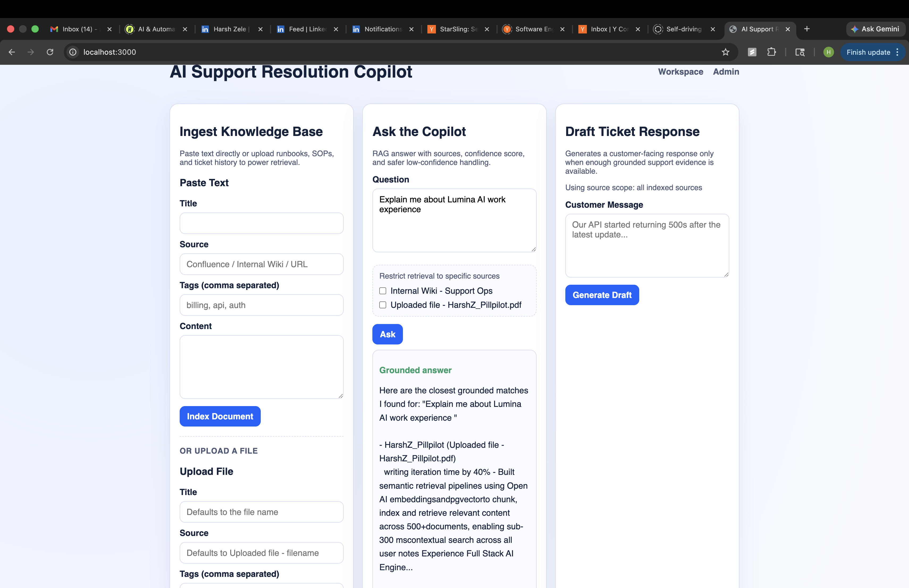
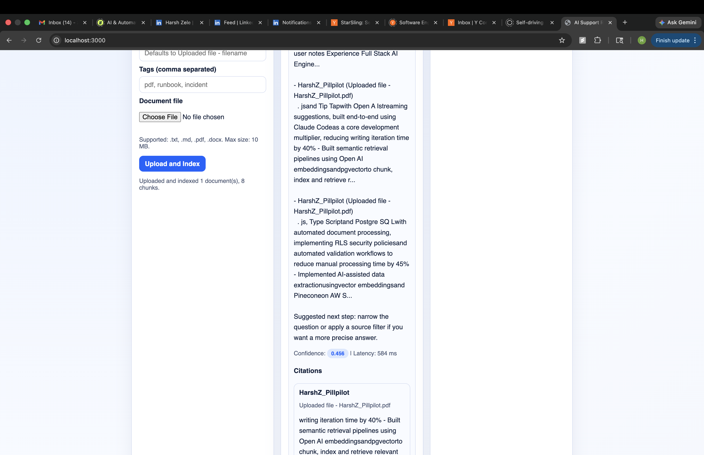
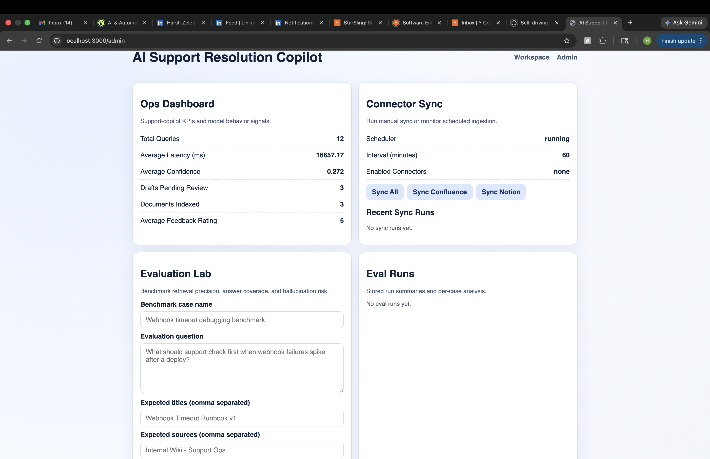
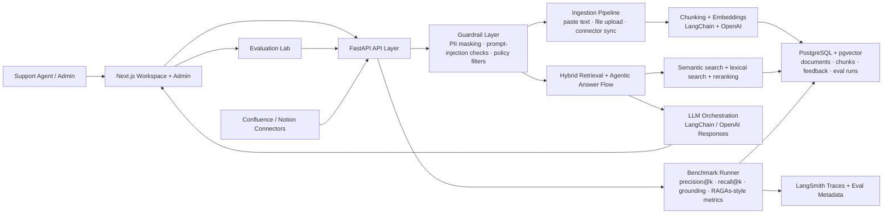

# AI Support Resolution Copilot

ResolveAI is a full-stack semantic search and support-resolution platform built with `Next.js`, `FastAPI`, `PostgreSQL + pgvector`, `LangChain`, and Docker. It ingests internal knowledge, supports file uploads and connector syncs, answers natural-language questions with grounded citations, drafts support responses, and benchmarks retrieval quality through an integrated evaluation lab.

## Screenshots

### Workspace Overview



### Grounded Answer + Source Filters



### Admin Dashboard + Evaluation Lab



## System Design



### Architecture Notes

- `apps/frontend`: Next.js workspace for ingestion, grounded Q&A, ticket drafting, sync controls, and eval inspection.
- `apps/backend`: FastAPI API for ingestion, retrieval, chat, ticket drafting, feedback, sync orchestration, guardrails, and evaluation runs.
- `PostgreSQL + pgvector`: stores documents, chunks, embeddings, query logs, ticket drafts, feedback, and benchmark metadata.
- `LangChain + OpenAI`: used for chunking, embeddings, LLM generation, and LangSmith-compatible tracing hooks.

## Core Features

1. Document ingestion (`/api/ingest/documents`) with automatic chunking and embedding.
2. File upload ingestion (`/api/ingest/upload`) for `.txt`, `.md`, `.pdf`, and `.docx` documents.
3. Hybrid retrieval (`semantic + full-text`) with reciprocal rank fusion.
4. Copilot chat (`/api/chat`) that returns answer + citations + confidence + latency, with low-confidence blocking and optional web fallback.
5. Ticket draft generation (`/api/tickets/draft`) for support responses with grounded-evidence guardrails.
6. Connector sync for Confluence + Notion with scheduled incremental ingestion.
7. Ops metrics (`/api/metrics`) and feedback capture (`/api/feedback`).
8. Evaluation Lab (`/api/evals/*`) for benchmark cases, retrieval hit rate, precision@k, recall@k, answer coverage, grounding score, and heuristic hallucination risk.
9. RAGAs-style evaluation metrics for answer relevance, faithfulness, context precision, and context recall.
10. LangSmith-compatible tracing hooks for embeddings, answer generation, ticket drafting, and benchmark runs.
11. Guardrails for PII masking, prompt-injection detection, and policy-based blocking.
12. Source-filtered retrieval, reranking, and low-confidence guardrails to block weak answers and weak customer drafts.

## Production-Grade Highlights

- End-to-end support-resolution workflow: ingestion, retrieval, grounded answering, ticket drafting, feedback capture, and benchmarking in one stack.
- Safety-first response path: weak retrieval is blocked, sensitive patterns are masked, and suspicious prompts are filtered before generation.
- Quality observability built in: benchmark runs track retrieval quality, grounding, hallucination risk, and RAGAs-style answer metrics.
- Traceable LLM flows: LangSmith hooks make generation and eval runs inspectable when tracing is enabled.

## Local Run (Docker)

### 1) Configure env

```bash
cd ai-support-copilot
cp .env.example .env
# Add OPENAI_API_KEY in .env for real model responses.
# Without it, the app uses deterministic local fallbacks.
```

### 2) Start stack

```bash
docker compose up --build
```

Services:
- Frontend: `http://localhost:3000`
- Backend API: `http://localhost:8000`
- Health check: `http://localhost:8000/health`

### 3) Use the app

1. Paste a support document or upload a `.txt`, `.md`, `.pdf`, or `.docx` file from the home page.
2. Use source filters to narrow retrieval to specific indexed sources.
3. Ask a support question to validate citation-grounded retrieval and confidence handling.
4. Generate a ticket draft from a customer message.
5. Open `/admin` to monitor KPIs, connector sync, and evaluation runs.

### File upload support

From the workspace UI you can now upload:
- `.txt`
- `.md`
- `.pdf`
- `.docx`

The backend extracts text, chunks it, embeds it, and stores it in Postgres/pgvector through the same ingestion pipeline used for pasted text.

### Guardrails + tracing configuration

Optional `.env` flags:

```env
GUARDRAILS_ENABLED=true
PII_MASKING_ENABLED=true
PROMPT_INJECTION_DETECTION_ENABLED=true
POLICY_FILTERING_ENABLED=true
LANGSMITH_TRACING_ENABLED=false
LANGSMITH_PROJECT=resolveai
LANGSMITH_API_KEY=
```

- `GUARDRAILS_ENABLED`: enables the safety layer for ingestion, Q&A, and ticket drafting.
- `PII_MASKING_ENABLED`: redacts emails, phone numbers, tokens, card-like strings, and similar sensitive values.
- `PROMPT_INJECTION_DETECTION_ENABLED`: blocks obvious “ignore instructions / reveal system prompt” style attacks.
- `POLICY_FILTERING_ENABLED`: blocks secret-exfiltration and data-dump style requests.
- `LANGSMITH_TRACING_ENABLED`: emits LangSmith traces for embeddings, generation, and benchmark runs when `LANGSMITH_API_KEY` is configured.

## Connector Sync Setup

Enable one or both connectors in `.env`:

```env
# Scheduler
SYNC_SCHEDULER_ENABLED=true
SYNC_INTERVAL_MINUTES=60

# Confluence
CONFLUENCE_ENABLED=true
CONFLUENCE_BASE_URL=https://your-domain.atlassian.net
CONFLUENCE_EMAIL=you@company.com
CONFLUENCE_API_TOKEN=your_confluence_api_token
CONFLUENCE_SPACE_KEYS=SUPPORT,ENG

# Notion
NOTION_ENABLED=true
NOTION_API_TOKEN=secret_xxx
NOTION_DATABASE_IDS=database_id_1,database_id_2
```

Manual sync endpoints:

```bash
curl -X POST http://localhost:8000/api/sync/run \
  -H "Content-Type: application/json" \
  -d '{"connector":"all"}'
```

```bash
curl http://localhost:8000/api/sync/runs?limit=20
```

```bash
curl http://localhost:8000/api/sync/status
```

## API Quick Test

```bash
curl -X POST http://localhost:8000/api/ingest/documents \
  -H "Content-Type: application/json" \
  -d '{
    "documents": [{
      "title": "Webhook Timeout Runbook",
      "source": "Internal Wiki",
      "content": "If webhook delivery fails with timeout, verify DNS, check outbound firewall rules, and increase retry backoff to 30s.",
      "tags": ["webhooks", "timeouts"]
    }]
  }'
```

```bash
curl -X POST http://localhost:8000/api/chat \
  -H "Content-Type: application/json" \
  -d '{"question":"How should we debug webhook timeout failures?","top_k":6}'
```

```bash
curl -X POST http://localhost:8000/api/ingest/upload \
  -F "file=@/absolute/path/to/runbook.pdf" \
  -F "title=Webhook Timeout Runbook" \
  -F "source=Uploaded PDF" \
  -F "tags=webhooks,incident,runbook"
```

## Evaluation Lab

Create benchmark cases:

```bash
curl -X POST http://localhost:8000/api/evals/cases \
  -H "Content-Type: application/json" \
  -d '{
    "cases": [{
      "name": "Webhook incident debugging",
      "question": "What should support check first when webhook timeout failures spike after a deploy?",
      "expected_titles": ["Webhook Timeout Runbook"],
      "expected_sources": ["Internal Wiki"],
      "expected_keywords": ["dns", "tls", "firewall", "rollback"],
      "expected_answer_points": ["verify DNS", "check TLS certificate", "review recent deploys"],
      "tags": ["retrieval", "support"]
    }]
  }'
```

Run a benchmark:

```bash
curl -X POST http://localhost:8000/api/evals/run \
  -H "Content-Type: application/json" \
  -d '{"label":"manual-benchmark","top_k":6}'
```

Inspect results:

```bash
curl http://localhost:8000/api/evals/runs
curl http://localhost:8000/api/evals/runs/<run_id>
```

Each eval run reports:
- retrieval hit rate
- precision@k / recall@k
- answer coverage
- grounding score
- hallucination risk
- RAGAs-style answer relevance
- RAGAs-style faithfulness
- RAGAs-style context precision / context recall
- LangSmith tracing metadata when enabled

## Cloud Deployment

## Option A: One-command VM deploy (Docker)

Use any VPS (AWS EC2, GCP Compute Engine, DigitalOcean):

1. Install Docker + Docker Compose.
2. Copy project and create `.env`.
3. Run:

```bash
docker compose up -d --build
```

4. Put Caddy/Nginx in front for TLS and domain routing:
- `api.yourdomain.com` -> backend `:8000`
- `app.yourdomain.com` -> frontend `:3000`

## Option B: Managed deploy split

- Backend + Postgres: Railway/Render
- Frontend: Vercel

### Backend (Railway/Render)

1. Deploy `apps/backend` as a web service.
2. Add managed Postgres (enable `vector` extension in DB).
3. Set env vars:
- `OPENAI_API_KEY`
- `DATABASE_URL` (use provider's Postgres URL with `postgresql+psycopg://`)
- `CHAT_MODEL`
- `EMBEDDING_MODEL`
- `CORS_ORIGINS` (include frontend URL)
- `GUARDRAILS_ENABLED`
- `PII_MASKING_ENABLED`
- `PROMPT_INJECTION_DETECTION_ENABLED`
- `POLICY_FILTERING_ENABLED`
- `LANGSMITH_TRACING_ENABLED`
- `LANGSMITH_PROJECT`
- `LANGSMITH_API_KEY`
- Optional connector sync vars:
  - `SYNC_SCHEDULER_ENABLED`
  - `SYNC_INTERVAL_MINUTES`
  - `CONFLUENCE_*`
  - `NOTION_*`
4. Start command:

```bash
uvicorn app.main:app --host 0.0.0.0 --port $PORT
```

### Frontend (Vercel)

1. Deploy `apps/frontend` as Next.js app.
2. Set env var:
- `NEXT_PUBLIC_API_URL=https://api.yourdomain.com`
3. Redeploy.

## What This Project Demonstrates

- Full-stack AI product engineering across Next.js, FastAPI, Postgres, pgvector, LangChain, and Docker.
- Production-minded RAG design with ingestion, retrieval, reranking, source scoping, and low-confidence blocking.
- AI quality engineering through benchmark cases, retrieval metrics, grounded-answer checks, and RAGAs-style scoring.
- AI safety engineering through prompt-injection checks, PII masking, and policy filters.
- LLM observability with LangSmith-ready tracing and evaluation metadata.
